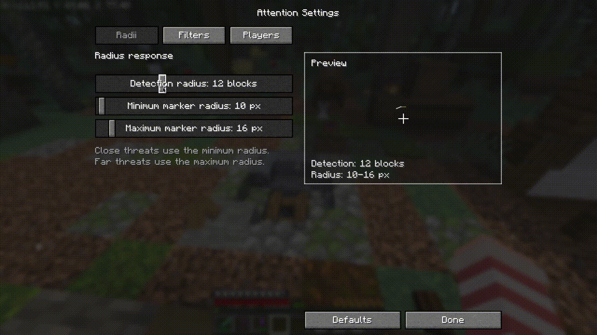

# ⚠️ Attention!


---


> A subtle vanilla-friendly QoL warning marker for off-screen danger.
>
> More awareness. Less panic. No gameplay-breaking mechanics.

Attention! is a client-only Fabric QoL mod for Minecraft `1.21.8` through `1.21.11`. It adds a compact marker around the crosshair when a nearby threat is outside your view.

The goal is simple: make it easier to keep control of the situation without changing the feel of vanilla Minecraft.

For a shorter storefront-style description, see [MODRINTH.md](MODRINTH.md).

## 🎥 Preview




## 🧠 What Is This?

**A small awareness mod that tries to stay out of the way.**

It gives you an early warning when something dangerous is just outside the screen, but it does not add new combat mechanics, radar gameplay, or noisy UI.

## ✨ Why Use It?

Attention! is for players who:

- want a little more control over nearby danger
- prefer subtle QoL over loud HUD elements
- want something that still feels close to vanilla
- get startled by sudden zombie hits or creeper explosions

It is especially useful if sudden off-screen hits make you jump and you want a calmer, earlier warning.

## 🎮 Controls

- `Open Attention Settings` exists as a separate keybind and is unbound by default.
- `/attention settings` opens the settings screen.
- `/attention reload` reloads the local config file.
- `/attention demo on`
- `/attention demo off`
- `/attention demo pulse`
- `/attention demo angle <degrees>`

If you use Mod Menu, the settings screen is also exposed there.

## ⚙️ Features

- Compact segmented marker near the crosshair.
- Warns for the nearest valid off-screen threat.
- Supports nearby hostiles, approaching hostiles, and off-screen players.
- Optional directional ping when the marker first appears.
- Detection radius is configurable from `6` to `24` blocks, with `12` as the default.
- Marker radius and player filtering are configurable in-game.
- Survival-only mode is available.
- Mod Menu integration.
- Client-side only.

## 🔧 Technical Details

### Detection And Tracking

- Threats only count when they are outside your current horizontal view margin.
- The nearest valid threat wins.
- Hostiles can be tracked as nearby threats, approaching threats, or both depending on settings.
- Players are filtered by alive state, spectator state, and your configured player filter.
- First appearance uses a short confirmation delay to reduce flicker.
- Tracked threats keep a small grace window so the marker does not drop instantly on minor state changes.

### Marker Behavior

- The marker is built from a 16-segment ring around the crosshair.
- Marker size uses a distance-based response curve.
- Close threats use the minimum configured radius.
- Far threats use the maximum configured radius.
- Appearance sound direction is snapped to the nearest visible segment for more stable left/right/front/back cues.

### Settings And Storage

- Config is saved locally at `config/attention.json`.
- Player names are stored as normalized lowercase entries.
- The settings screen can reset everything back to defaults.

## 🧩 Compatibility

| Minecraft | Status | Notes |
| --- | --- | --- |
| `1.21.8` | Supported | Runs from the shared universal jar. |
| `1.21.9` | Supported | Runs from the shared universal jar. |
| `1.21.10` | Supported | Runs from the shared universal jar. |
| `1.21.11` | Supported | Runs from the shared universal jar. |

## 📦 Installation

1. Install Fabric Loader for your Minecraft version.
2. Install the matching Fabric API version.
3. Drop the `Attention!` jar into your instance `mods` folder.
4. Launch the game.
5. Open settings through Mod Menu or bind the settings key.

This is a client-side mod. Dedicated servers do not need it installed.

## ❓ FAQ

### Does it work on servers?

Yes. It is client-side.

### Do other players need to install it?

No.

### Does it warn about things already on screen?

No. It is built around off-screen threat awareness.

### Is it meant to stay vanilla-friendly?

Yes. The mod is meant as subtle QoL, not a gameplay overhaul.

### Can I disable player warnings?

Yes. You can disable player warnings entirely or restrict them with the player filter list.

### Can I change the marker size?

Yes. Both minimum and maximum marker radius are configurable in the settings screen.

### Where is the config stored?

`config/attention.json`

## 🛠️ Build From Source

Java `21` is required.

```bash
./gradlew build
```

On Windows:

```powershell
.\gradlew.bat build
```

Artifacts are written to `build/libs/`.

The default build produces a single jar compiled from the shared `1.21.8` compatibility baseline and intended to run across `1.21.8` through `1.21.11`.

## 🧪 Local Test Clients

Windows helper scripts are included for all supported versions:

```powershell
.\scripts\run-client-1.21.8.ps1
.\scripts\run-client-1.21.9.ps1
.\scripts\run-client-1.21.10.ps1
.\scripts\run-client-1.21.11.ps1
```

There is also a shared launcher script:

```powershell
.\scripts\run-client.ps1 -McVersion 1.21.11
```

And a startup verification helper:

```powershell
.\scripts\verify-launches.ps1
```

## 📁 Project Layout

- `src/main/` contains the mod entrypoint, threat sound registration, and shared math.
- `src/client/` contains config, HUD rendering, threat detection, commands, and settings UI.
- `src/client/` also contains the runtime compatibility layer used by the universal jar.
- `scripts/` contains local build and client-launch helpers.

## ⚖️ License

Licensed under [GPL-3.0](LICENSE).
